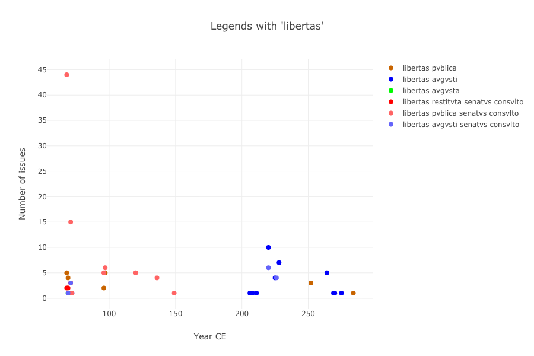

#### "Tweeting" in Roman Imperial Coin Legends

> Thomas R. Martin, Thomas Posillico, D. Neel Smith (College of the Holy Cross)

The invaluable dataset of the *Online Coins of the Roman Empire* (OCRE), a joint project of the American Numismatic Society and the Institute for the Study of the Ancient World at New York University, is available for download and reuse under an open license.   This means that, in addition to the website at <http://numismatics.org/ocre/>, scholars can explore its multidimensional data with a variety of computational  tools. Our talk

#### More information

|                                                                                                                                                                    |                            |
|:-------------------------------------------------------------------------------------------------------------------------------------------------------------------|:---------------------------|
| All  For more information, including links to Jupyter notebooks you can run in a web browser, see:  <http://neelsmith.info/current-projects/tweeting/aha/> |  |
|                                                                                                                                                                    |                            |
