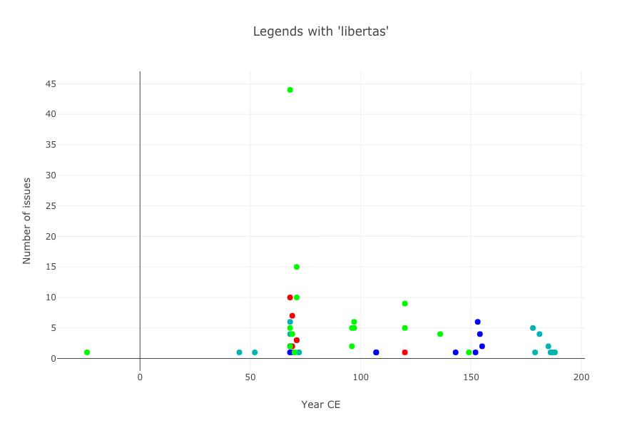

Slide deck from the January 4, 2020, panel "Numismatics and Ancient History: New Approaches and Directions" at the American Historical Association annual meeting:

- Thomas Martin, Thomas Posillico and Neel Smith, "Tweeting in Roman Imperial Coin Legends:
    - [HTML](slides/)
    - [PDF](pdf/aha.pdf)

The source for these slides and all the data and scripts analyzing content in OCRE are [available on github](https://github.com/neelsmith/aha).

This preliminary work is part of a longer-term exploration of Roman imperial coinage as "tweets."  For more information, see

- [this page](http://neelsmith.info/current-projects/tweeting/), including links to live Jupyter notebooks you can run in a web browser.
- a growing series of [blog posts](http://neelsmith.info/tag-coins/) explaining the analyses in these notebooks.

