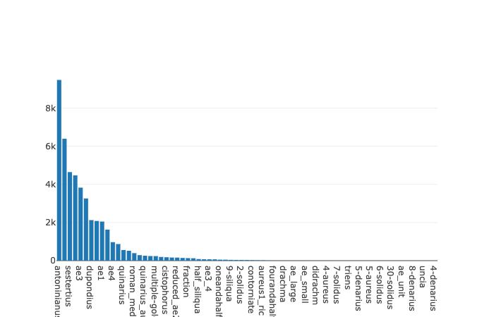

[](https://mybinder.org/v2/gh/neelsmith/nomisma-jupyter/master?filepath=ocre%2FFrequencies_ocre.ipynb)

## TL;DR

Go straight to [the Jupyter notebook](https://mybinder.org/v2/gh/neelsmith/nomisma-jupyter/master?filepath=ocre%2FFrequencies_ocre.ipynb).  To look under the hood, keep reading.

## Background

A [previous post](http://neelsmith.info/hc/2019-12-01-validating-ocre/) showed how to check valid data values once you've created an `Ocre` object. To see how many valid values OCRE includes for denomination, for example, we can use the `hasDenomination` function to find only issues with valid data values for that property, and  apply the `denominationList` to that result to get a list of unique values.

This brief summary goes all the way from loading OCRE data to showing how many distinct denominations it records:

```scala
import edu.holycross.shot.nomisma._
val ocreCex = "https://raw.githubusercontent.com/neelsmith/nomisma/master/cex/ocre-cite-ids.cex"
val ocre = OcreSource.fromUrl(ocreCex)
println("Number of valid values for denomnination: " + ocre.hasDenomination.denominationList.size)
```
    Number of valid values for denomination: 71

## How often? The `Histogram` class

Seventy one seems like a lot of denominations.  How often does each denomination appear in one of OCRE's 50,000+ issues?

The `Ocre` class includes a function to create a `Histogram` object for a named property. If you're in to Scala, you'll appreciate that the `Histogram` class is parameterized by type:  it computes and works with frequencies of objects of any class you specifiy.  Here, we'll just work with histograms of strings, but we could equally easily construct histograms of `OcreIssue`s, for example.

The histogram has a Vector of `Frequency`s, each of which has one value of the specified type and an integer count for it.  The histogram's `sorted` function sorts the histogram by count from highest to lowest value, so  we can look at the first and last of the sorted entries to see the most and least common values in OCRE for denomination.

```scala
import edu.holycross.shot.histoutils._
val denominationHisto: edu.holycross.shot.histoutils.Histogram[String] = ocre.histogram("denomination").sorted
println("Entries in histogram of denominations: " + denominationHisto.size)
println("Most frequent denomination:  " + denominationHisto.frequencies.head)
println("Least frequent denomination: " + denominationHisto.frequencies.last)
```
    Entries in histogram of denominations: 71
    Most frequent denomination:  Frequency(antoninianus,9472)
    Least frequent denomination: Frequency(4-denarius,1)

This is helpful, but a visualization as a bar graph would be easier to interpret.  Since our notebook is using the [almond.sh](https://almond.sh/) kernel, we can do that in Scala with the plotly library.

```scala
// Import plotly, set default height as recommended
// by almond.sh for use in Jupyter notebooks
import plotly._, plotly.element._, plotly.layout._, plotly.Almond._
repl.pprinter() = repl.pprinter().copy(defaultHeight = 3)
```

Plotly can construct a bar graph from two parallel lists of values for x and y values.  We can use the `item` and `count` properties of our histogram's `Frequency` objects for x and y respectively.

```scala
val denominationValues = denominationHisto.frequencies.map(_.item)
val denominationCounts = denominationHisto.frequencies.map(_.count)

val denominationPlot = Seq(
  Bar(x = denominationValues, y = denominationCounts)
)
plot(denominationPlot)
```
Your output should include a graph that looks like this (although in the Jupyter notebook, it will be interactive):




## Jupyter notebook

The notebook to accompany this blog post repeats this process to visualize a histogram of geographic regions.  It is `ocre/Frequencies_ocre.ipynb` in the notebook [github repository](https://github.com/neelsmith/nomisma-jupyter), or you can read it on `mybinder.org` [here](https://mybinder.org/v2/gh/neelsmith/nomisma-jupyter/master?filepath=ocre%2FFrequencies_ocre.ipynb).  [](https://mybinder.org/v2/gh/neelsmith/nomisma-jupyter/master?filepath=ocre%2FFrequencies_ocre.ipynb)


 .
