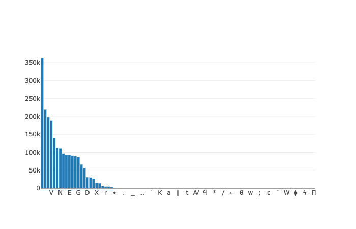

## Overview

In previous posts (outlined [here](http://neelsmith.info/current-projects/tweeting/) and [in this series of Jupyter notebooks](https://mybinder.org/v2/gh/neelsmith/nomisma-jupyter/master?filepath=index.ipynb)), I have discussed loading and verifying the contents of `nomisma.org`  data sets, and have shown how to create a citable text corpus directly from collection like OCRE.

In the next series of posts on working with OCRE, I want to focus on the texts of tens of thousands of coin legends.  The ultimate goal is to develop a parallel, aligned corpus of texts with abbreviations in the diplomatic texts in OCRE fully expanded, and morphologically parsed.  This will entail:

1. Analyzing the contents of OCRE's diplomatic texts and explicitly specifying an allowed character set.
2. Expanding the abbreviated texts into an aligned edition with its own specified orthography.
2. Formally specifying the orthographic usage of the expanded corpus, and implementing a categorized tokenization.
3. Developing a morphological parser for the expanded text corpus using `tabulae`, a system for building corpus-specific morphological parsers.
4. Parsing the expanded corpus.

##  Analyzing  character usage in OCRE coin legends

There are 50644 issues in OCRE (as seen [this earlier blog post](http://neelsmith.info/hc/2019-12-09-validating-RDF/)).  Of these, 50148 have obverse legends and 48418 have reverse legends, for a total of 98566 legends.  The OCRE transcription of those legends totals 2,144,309 characters, for an average length of roughly 21 characters per legend.

OCRE's records use 91 distinct characters in these texts, but their distribution has a *very* long tail (illustrated here, or see the interactive plot in [the accompanying Jupyter notebook](
https://mybinder.org/v2/gh/neelsmith/nomisma-jupyter/master?filepath=ocre%2FOcre_char_set.ipynb)).  'I' appears more than 200,000 times (roughly 10% of all characters), and 'A' is nearly as frequent; at the other extreme are several Greek characters that show up once

To understand this distribution better, we can split it into two sections at a threshhold where the frequencies drop off dramatically.  I use 600 occurrences as a cut-off point (that is, characters representing less than three-tenths of one percent of the two million characters in OCRE).  Only 25 characters appear above this threshhold, and they account for 99.8% of character occurrences in OCRE.  Sixty-six characters fall below the threshhold, and in total comprise only 0.18% of character occurrences.  

The 25 frequent characters include the space character, two  punctuation marks, and 20 upper-case alphabetic characters (since OCRE follows RIC in transcribing legends in upper case). Unexpectedly, the lower-case letters 'o' and 'r' also appear.  These are in every case comments in English that have been incorporated into the text of the legend. The surprising frequency of those two letters (in contrast to the minuscule numbers of other lower-case letters) is due to the practice in later volumes of RIC of offering alternate readings of the legend's text separated by the word 'or'.

Our goal in specifying characters that we will accept in legends is to enable us to process tens of thousands of legends automatically.  We will exclude the 'o' and 'r' characters, but keep the 23 other frequent characters.

Of the 66 less frequent characters, most are characters we want to exclude:  lower-case letters used for English comments, Greek characters we won't process in our morphological parsing, or punctuation such as brackets and ellipses indicating lacunae or editorial restoration, categories of legends that we want to exclude from our subsequent textual analysis.  There are a handful of transcription errors (either in RIC or OCRE's digitization) where a 'J' or 'U' has slipped in, in contradiction to RIC's normal standard of using 'I' and 'V' for both vocalic and consonantal values.  We will exclude these characters, too.

There are, however, three less common upper-case alphabetic characters (in descending order of frequency, 'Z', 'Y', and 'K'), and a couple of further punctuation marks that we an process in our textual analysis.  In total, this makes 23 upper-case alphabetic characters, four punctuation marks and the white space, for the following complete alphabet of 28 characters:

"ABCDEFGHIKLMNOPQRSTVXYZ -•←|"

To prepare for subsequent textual analysis, we filter the legends to exclude any texts including characters outside this list. Of the 98,566 legends in OCRE, more than 96.5% use only these 28 characters; fewer than 3.5% are excluded.

The next post in this series will use the 96.5% of legends with clean orthography as a basis for creating a parallel version with fully expanded text.

For more details and the mechanics behind the summary of OCRE's character usage, see the Jupyter notebook accompanying this post:  
 `ocre/Ocre_char_set.ipynb` in [my nomisma-jupyter](https://github.com/neelsmith/nomisma-jupyter) repository on github, or running [on `mybinder.org`](https://mybinder.org/v2/gh/neelsmith/nomisma-jupyter/master?filepath=ocre%2FOcre_char_set.ipynb).  
