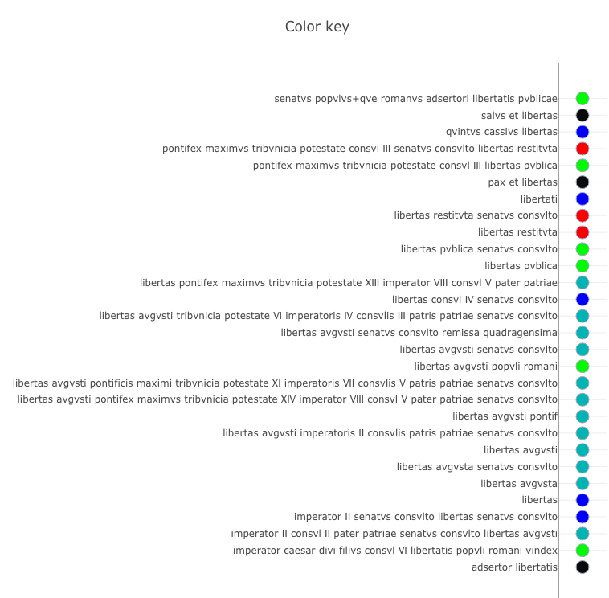
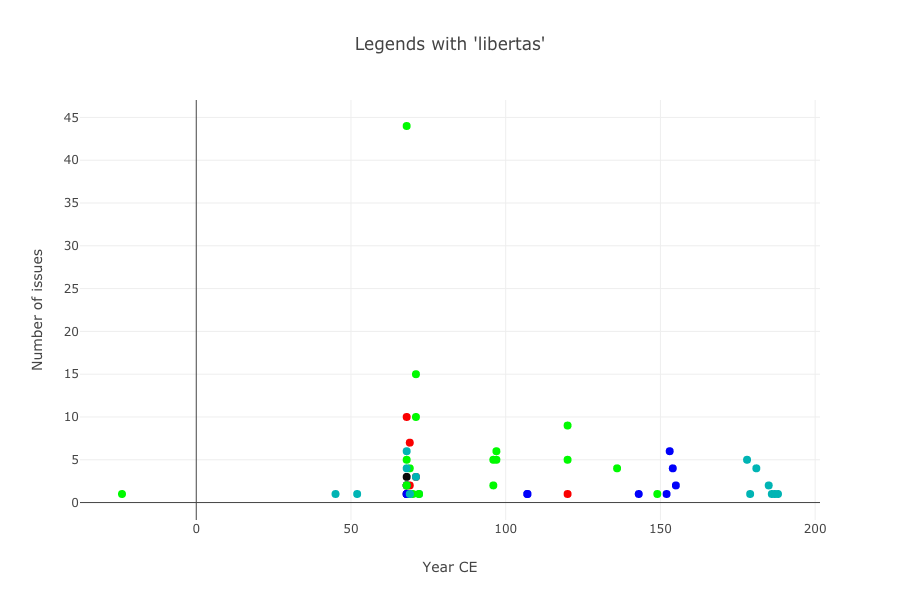

On Saturday, Thomas Martin, Thomas Posillico and I presented at the American Historical Association's annual meeting about "Tweeting in Roman Imperial Coinage." (Slides from our talk and further links [available here](http://neelsmith.info/current-projects/tweeting/aha/).)

We used a fully expanded and morphologically parsed corpus of the coin legends in [OCRE](http://numismatics.org/ocre/) corresponding to volumes 1-3 of the print edition of *Roman Imperial Coinage*, and therefore covering Augustus through Commodus (31 BCE - 193 CE).  I plan to add further blog posts explaining how we created the expanded and parsed corpus, but would like to introduce here the  example we looked at in our brief talk, namely the use of the term *libertas*.  *Libertas* has long been recognized as a hot-button issue when it appears in imperial coinage: see, for example, the short article by C.H.V. Sutherland (not coincidentally, the editor of *RIC* volumes 1-3), "The concepts Adsertor and Salus as used by Vindex and Galba", *The Numismatic Chronicle* 144 (1984) 29-32.

*Libertas* appears in the legend of 204 dated issues, in nominative, genitive or dative cases, in 29 distinct legends.  I manually grouped the 29 legends into five classes, illustrated in the color key below:

1. Blue dots mark legends that refer to *libertas* without further qualification.
2. Gray-blue dots mark legends that modify *libertas* with the adjective *avgvsta* or noun *avgvsti*, so the *libertas* "of" or "deriving from" the emperor.
3. Green dots mark legends qualified with the adjective *pvblica* or the noun *popvli*, so the *libertas* "of" the people.
4. Red dots mark legends describing *libertas* as *restituta*, "recovered" or "restored."
5. Black dots mark legends that join *libertas* with one of the nouns *salvs*, *pax* or *adsertor*.

We associate every text in our corpus with the obverse or reverse of an issue in OCRE, and can therefore use OCRE's information about each issue (such as date, or mint) to contextualize patterns in the texts.  The following chart shows the number of issues struck per year in each of the five color-coded classes.

Augustus first introduces the theme in the 20s BCE in the phrase *libertatis popvli romani vindex*, "guarantor of the people's *libertas*." (Interestingly, these coins are cistophori, a non-Roman denomination struck in the East.)  When Claudius picks up the theme in the 40s and 50s CE, his legends refer to "*libertas* of/from the Emperor" for the first time (gray-blue dots).  The enormous spike in 68-70 CE are issues extending the civil wars into a tweet war among the numerous claimants to imperial power.  As the mix of colors suggests, different candidates strike coins using *libertas* in a wide variety of legends, as each general positions himself in relation to *libertas* as a way to assert his claim to legitimacy.

Following the Civil Wars, the battle over language seems to be settled.  For roughly a century, legends referring to *libertas* (with only one exception) either name *libertas* without qualification (blue dots) or describe it as "*libertas* of the people" (green dots). The rhetoric changes under the Antonines, however, when  in the 180s and 190s, *libertas* is again presented as "of/from the emperor" (blue-gray dots).

Each of these observations suggests questions that could be explored at much greater length, but they illustrate how a parseable text corpus associated with OCRE coin issues allows us to visualize patterns of language in relation to numismatic data.

## Sources

[This github repository](https://github.com/neelsmith/aha) includes both the source for our [slides](http://neelsmith.info/current-projects/tweeting/aha/), and scala scripts that can generate all the analyses and graphics we used.
